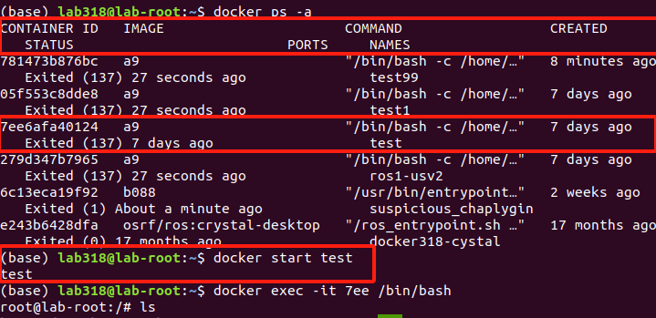

# 全国海洋航行器设计与制作大赛
## C4智能导航赛道操作手册

## 1 平台简介

### 1.1平台描述

&nbsp;&nbsp;&nbsp;&nbsp;&nbsp;&nbsp;SpaceR-USV 是一款先进的智能无人船虚拟仿真训练平台，该平台由基于Unity的虚拟三维仿真引擎、基于Simulink的无人船运动模型和基于ROS的无人船航控系统三部分组成。平台基于Unity引擎进行航行场景设计和传感器数据获取，提供高逼真的视觉和物理仿真，为无人船的导航训练提供有效的模拟平台；基于Simulink搭建无人船运动数学模型，为避障算法提供符合物理规律的运动学和动力学约束，考虑风、浪、流三种环境因素的影响，在运动数学模型中加入对应干扰力的计算，使算法仿真更贴合实际；基于ROS的无人船航控系统旨在实现无人船的自主导航、任务执行和操作控制。该系统利用ROS提供的一系列工具和库，实现无人船的感知、决策和控制功能，使其能够在复杂的环境中自主航行和执行任务。


### 1.2平台框架

&nbsp;&nbsp;&nbsp;&nbsp;&nbsp;&nbsp;智能无人船虚拟仿真训练平台框架主要涉及六个模块：

- &nbsp;&nbsp; &#9679; 环境交互显示模块：提供水域地形、环境条件和船舶模型号等信息。
- &nbsp;&nbsp; &#9679; 无人艇模型：包括三维几何和物理运动模型，用于模拟无人艇的行为。
- &nbsp;&nbsp; &#9679; 环境感知模块：通过激光雷达、视觉相机等传感器收集环境数据。
- &nbsp;&nbsp; &#9679; 运动控制模：块负责无人艇的电机和舵机控制。
- &nbsp;&nbsp; &#9679; ROS数据通信模块：在各模块之间传递数据，并负责信息处理，确保系统协调工作。
- &nbsp;&nbsp; &#9679; 避障算法模块：使用强化学习（如PPO、TD3）和监督学习进行路径规划和障碍物规避，提升无人艇的自主导航能力。


## 2 无人船硬件介绍

### 2.1 无人船船体参数


|    参数名称    |                            参数值                            |
| :------------: | :----------------------------------------------------------: |
|      船长      |                            1.3 m                             |
|      型宽      |                            0.64 m                            |
|    吃水深度    |                            18 cm                             |
|    最高航速    |         1.8 m/s（使用船自带遥控的极限速度是2.4 m/s）         |
|    船体材料    |                       玻璃纤维增强材料                       |
|    动力系统    |                        2x 喷泵推进器                         |
|  定向巡航速度  | 定速巡航速度在1-1.5 m/s时，效果较好，低于1 m/s时，电机推力会降的比较低。 |
|  定速巡航速度  |                           1.4 m/s                            |
|    续航时间    |          满功率大约2 H，限定功率测试一般可达到 4-5H          |
|    通信距离    |                           大约2 km                           |
|    转弯半径    |             油门100%，方向50%时，转向半径5m左右              |
| 最大转向角速度 |                            45 °/s                            |

### 2.2 无人船使用说明

-  无人船开机按钮在船体后方，按下按钮即可启动，启动后不要立即去动拨杆操控无人船，等待30s 后，可使用遥控器进行遥控。
-  使用手柄进行无人船操控时，需要将无人船遥控器左上角的拨杆向下拨动，等待10s，系统会切换至手柄模式
-  遥控器操控：需将遥控器左上方的拨片拨到下面， 等待10s，左右拨杆同时向前推表示操控无人船直线向前行驶，左侧拨杆推的幅度比右侧拨杆小，可以使无人船向右转，右侧拨杆推的幅度比左侧拨杆小，可以使无人船向左转，两个拨杆同时向后推可以使无人船倒车
-  手柄连接：无线手柄通过蓝牙与电脑连接即可，有限手柄需长按手柄中的圆形按钮，待【实时状态】栏中显示遥控器已连接即可。手柄链接后，需将无人船遥控器左上方的拨片拨到上面， 等待10s，即可开始操控，左边拨杆可控制前进和后退，右边拨杆可以控制方向。
-  使用无人船遥控器进行无人船的操纵时，尽量不要把拨杆推理推的太满，可能会导致无人船自身控制程序占用进程，出现船体右舵转圈的现象，解决方法是关闭电源重启

### 2.3 无人船存放与平时维护须知


> 1. 存放条件：无人船保养尽量在**室内存放**，后舱盖打开，排出舱内水汽
> 2. 电量检查：1-2个月不使用的情况下，每个月要开机检查一下电压，看是否亏电，若亏电就补充一点，不可充太满。**存放期间31-32V**之间都可以，尽量**不要低于30V**。
> 3. 满电电压：**满电33V ，低电压28V**，做实验之前要提前观察电量
> 4. 其他：冬季实验，户外温度低于-10℃时，充电要回到屋子里恢复到室温再充电。（非低温电池）


## 3 环境搭建

### 3.1 基于Unity的虚拟三维仿真引擎

#### 3.1.1简介

&nbsp;&nbsp;&nbsp;&nbsp;&nbsp;&nbsp;现有的无人船算法仿真训练平台一定程度上简化了无人船模型与航行环境影响因素，仿真所采用的传感器模型也与实际情况有所出入，同时缺乏算法在不同场景条件下的测试评估以及与实船对接交互的端到端验证方案。针对无人船算法仿真训练平台存在的上述问题，我们基于Unity引擎开展仿真训练平台的开发精细化的智能无人船虚拟仿真场景，实现航行环境的构建。

&nbsp;&nbsp;&nbsp;&nbsp;&nbsp;&nbsp;航行环境模块提供多种水域环境、地形地貌、水面、障碍物以及包括重力、浮力、航行阻力等多种力学因素，以供训练与测试；同时提供便捷的人机交互界面，供用户对虚拟场景（如岛屿场景、湖泊场景、校园场景等）、环境条件（如风浪、雨雪、雷电等）、船舶类型进行不同选择。此外，我们还提供场景的定制服务，根据用户实际需求为用户搭建场景，提供个性化服务。


#### 3.1.2 搭建步骤

&nbsp;&nbsp;&nbsp;&nbsp;&nbsp;&nbsp;
监控平台基于Unity进行开发，采用免安装的方式部署在Windows电脑上，打开软件包目录，鼠标双击USCP.exe文件即可运行监控软件。


&nbsp;&nbsp;&nbsp;&nbsp;&nbsp;&nbsp;

&emsp;&emsp;进入平台界面，可以看到平台各个功能按钮，如实时状态显示、航线编辑、调整参数、算法训练、数据记录、数据分析、系统设置等。


### 3.2 基于Simulink的无人船运动模型

#### 3.2.1 简介

&nbsp;&nbsp;&nbsp;&nbsp;&nbsp;&nbsp;基于Simulink搭建无人艇运动数学模型，为避障算法提供符合物理规律的运动学和动力学约束；考虑风、浪、流三种环境因素的影响，在运动数学模型中加入对应干扰力的解算，使算法仿真更贴合实际。

#### 3.2.2 搭建步骤

（1）双击打开MATLAB，并点击浏览文件夹将项目导入


（2）选中项目工程文档，点击导入


（3） 将项目工程中的所有文件依次选中，单击右键，将项目工程中的文件都添加到路径中

   **注：是所有文件夹都要添加到路径中**


（4）添加到路径之后文件夹都会进行增亮显示，此时点击路径栏中的文件夹USV130demo，进入到Simulation路径下

​    **注：若当前不在Simulation下，则需要将所有文件夹右键添加到路径**


（5）双击USV130Demo.slx文件，进入到工程界面


(6)项目工程界面


（7)点击上方导航栏按钮运行即可启动


（7)运行成功后，会在窗口下方出现“运行成功”或“正在运行”的字样


### 3.3基于ROS的无人船航控系统

#### 3.3.1 简介

&nbsp;&nbsp;&nbsp;&nbsp;&nbsp;&nbsp;基于ROS的无人船航空系统旨在实现无人船的自主导航、任务执行和操作控制。该系统利用ROS提供的一系列工具和库，实现无人船的感知、决策和控制功能，使其能够在复杂的环境中自主航行和执行任务。

#### 3.3.2 搭建步骤

(1) Docker安装

- [Ubuntu Docker安装](http://https://www.runoob.com/docker/ubuntu-docker-install.html "Ubuntu Docker安装")
- [Windows Docker安装](http://https://www.runoob.com/docker/windows-docker-install.html "Windows Docker安装")
- [MacOS Docker安装](http://https://www.runoob.com/docker/macos-docker-install.html "MacOS Docker安装")

(2) 加载docker镜像

```
docker load -i ros_image.tar
```

(3) 启动容器

```
docker run --network=host --name=ros1-usv -v /usr/local/project:/usr/local/project -itd f99 /bin/bash
```

(4) 部署工程到docker的共享目录

```
/usr/local/project
```

(5) 连接docker容器
//查看容器ID和状态：

```
 docker ps -a
```


 	&nbsp;&nbsp;&nbsp;&nbsp;&nbsp;&nbsp;
  通过Docker ps -a 命令查看容器的ID,名字和状态，若容器显示Exited(0)，则表示容器已经停止，此时需要运行停止的Docker容器，进行重新启动。
//运行Docker容器：

```
docker start {XXX} 
```

**注：这里的{XXX}指的是容器ID的前三位数字，下面同理**

&nbsp;&nbsp;&nbsp;&nbsp;&nbsp;&nbsp;运行容器既可以使用docker start 容器ID前三位数字，也可以使用 docker start 容器name



//进入容器：

```
Docker execute -it {XXX} /bin/bash
```

此处的{XXX}依然指的是容器ID的前三位数字 


(6) 启动ROS控制端

//进入工程目录 

```
cd /usr/local/project/usv_main_ws/             
```

```
 source devel/setup.bash
```

//启动控制端

```
 roslaunch usv_main_node usv_main.launch
```


（7) 启动成功


## 4 使用指南

&nbsp;&nbsp;&nbsp;&nbsp;&nbsp;&nbsp;无人系统仿真平台监控软件（简称：监控软件）是一款功能强大的虚实仿真工具，集动态场景加载与展示、航线编辑、路径规划、避碰算法扩展、在线调参以及强化学习训练等多项功能于一身。它旨在为无人系统仿真和算法试验提供更为便捷、直观的操作体验。通过集成Unity仿真环境和ROS通讯网络等基础架构，该软件极大地简化了用户在算法验证和强化学习训练过程中的环境搭建步骤，使用户能够专注于算法本身的研究与优化，从而显著提升工作和学习效率。

### 4.1 添加场景和智能体

&nbsp;&nbsp;&nbsp;&nbsp;&nbsp;&nbsp;监控软件支持动态添加场景和智能体，用户可使用该软件默认集成的智能体，也可以手动进行添加。

&nbsp;&nbsp;&nbsp;&nbsp;&nbsp;&nbsp;用户在Unity中制作好场景或智能体，将场景或智能体打包成AB包后，打开监控软件安装目录，找到**USCP_Data/StreamingAssets**目录，将打包好的AB包放入该目录，使用文本编辑器打开**ab_conf.json**文件，添加该AB包的描述信息；场景的描述信息包括场景名称、AB包名称以及该场景适用的智能体类型，智能体的描述信息包括智能体名称、AB包名称、AB包内的资源名称以及智能体类型。完成添加场景或智能体后，启动监控软件，即可在首页显示出已添加的场景和智能体。


### 4.2 选·择初始化

&nbsp;&nbsp;&nbsp;&nbsp;&nbsp;&nbsp;打开软件安装目录，双击USCP.exe文件即可运行该软件。在该软件初始化界面上，可以选择所需的场景、智能体以及运行模式；该软件运行模式包括虚拟仿真和数字孪生两种，在虚拟仿真模式下，系统里的场景、智能体以及智能体的控制模型都是虚拟的，用户可以在非真实世界中完成对算法的调试或训练；数字孪生模式下，系统里的场景和智能体都是以数字孪生的模式展示真实世界；在数字孪生模式下，该软件可控制真实的智能体运动、规划航线、定速定向巡航等，同时真实智能体的运动状态和环境也可以在该软件中展示。

选择好场景、智能体以及运行模式后，点击确定即可进入系统主界面；点击取消会退出本软件。


### 4.3 实时状态界面

#### 4.3.1 实时状态展示

&nbsp;&nbsp;&nbsp;&nbsp;&nbsp;&nbsp;点击实时状态按钮，即可进入实时状态界面。在系统界面右边会显示实时状态面板，该面板上实时显示当前智能体的姿态、运行状态、环境信息以及基础状态等。其中，基础状态包括船舶模型是否连接、遥控器是否连接以及当前视角。

&nbsp;&nbsp;&nbsp;&nbsp;&nbsp;&nbsp;当船舶模型显示未连接时，需要先启动船舶模型程序；当遥控器显示未连接时，需要先将遥控器插入本计算机，并拨动几下遥控器摇杆，如果还是显示未连接，需要长按5秒遥控器模式切换按钮，将遥控器切换到正确的模式，同时拨动遥控器摇杆，如此反复，直到遥控器状态显示已连接。


#### 4.3.2 当前航线显示	

通过连接手柄，可以在虚拟仿真平台中对无人船进行操控，平台会实时记录无人船的运动轨迹，并可视化到界面上。

	

#### 4.3.3 巡航设置

&nbsp;&nbsp;&nbsp;&nbsp;&nbsp;&nbsp;监控软件支持定速定向巡航功能设置，在实时状态界面，点击状态面板下方的第三个圆按钮，即可切换到巡航设置面板。在巡航设置面板，点击加、减按钮或者直接输入想要设定的值，即可完成定速定向巡航的设置。定速定向巡航功能都支持开启和关闭，点击对应按钮即可完成设置。


#### 4.3.4 环境设置

&nbsp;&nbsp;&nbsp;&nbsp;&nbsp;&nbsp;监控软件支持设置水环境插件的风速和浪速，风速和浪速值设置较大时，水面将变得波涛汹涌，风速和浪速值设置较小时，水面将变得平静，风速和浪速值都设置为0时，水面将不产生任何波纹，光滑如镜。

&nbsp;&nbsp;&nbsp;&nbsp;&nbsp;&nbsp;通过拖动风速和浪速的滑块，实现对风速和浪速的设置，拖动过程中可以实时查看当前风速和浪速的水面效果。当设置好风速和浪速后，点击保存按钮，即可保存设置。


#### 4.3.5 船舶模型设置

&nbsp;&nbsp;&nbsp;&nbsp;&nbsp;&nbsp;通过船舶设置可以修改船舶的型长、型宽、片体宽、质量、纵向重心、吃水深度、阻力系数、密度、水动力导数等参数,从而可以根据需求配置不同的船舶模型

  |  船舶参数  |                           参数解释                           |
  | :--------: | :----------------------------------------------------------: |
  |    型长    |       船舶的最大长度，通常从船首的最前端到船尾的最后端       |
  |    型宽    |          船舶的最大宽度，通常是指船体在最宽处的距离          |
  |   片体宽   | 船舶在设计水线处的宽度，与型宽不同，它是在水线面上的投影宽度。 |
  |    质量    |                        船舶本身的重量                        |
  |  纵向重心  | 指船舶总重量（包括结构、设备、货物、燃料等）在船舶纵向（即从船首到船尾）方向上的重心位置 |
  |  吃水深度  |  船舶底部与水面的垂直距离，影响船舶的载重能力和可通过的水域  |
  |  阻力系数  | 描述流体阻力与流体动力学参数（如速度、密度等）之间关系的系数，用于计算船舶在水中航行时所受到的阻   力 |
  |    密度    |                        水域环境的密度                        |
  | 水动力导数 | 描述船舶运动方程中各种力和力矩与船舶运动状态参数（如速度、加速度、舵角等）之间关系的参数 |


#### 4.3.6 坐标转换设置

&nbsp;&nbsp;&nbsp;&nbsp;&nbsp;&nbsp;监控软件坐标转换功能用于Unity坐标和真实世界GPS坐标之间的转换，以实现数字孪生展示的目的。在坐标转换功能里，可以选一个点将Unity坐标和真实世界的GPS坐标进行标定，从而找出两种坐标之间的对应关系，进一步实现坐标转换的功能。

&nbsp;&nbsp;&nbsp;&nbsp;&nbsp;&nbsp;在标定时，选择显示采样点标记选择框，当已进行过标定时，界面上将在已标定的位置立一根杆子，作为标定点；当是第一次进行标定时，会在当前屏幕中心立一根杆子。此时，可以使用键盘上、下、左、右键移动杆子，将杆子移动到想要标定的点上，同时，GPS采样人员行走到真实世界的标定位置，采集当前位置的GPS坐标，将GPS坐标输入到界面坐标转换面板中，并填写真实世界与Unity场景的缩放比例，点击保存按钮，即可完成坐标标定。

<div style="text-align: center;">
  
</div>

#### 4.3.7 控制模式切换

&nbsp;&nbsp;&nbsp;&nbsp;&nbsp;&nbsp;智能体在行驶时，可以在待机、遥控、自动三种控制模式之间转换，监控软件支持通过发送指令给智能体，从而改变智能体行驶时的控制模式。

&nbsp;&nbsp;&nbsp;&nbsp;&nbsp;&nbsp;当智能体处于待机模式时，点击遥控按钮，可向智能体发送遥控的指令，从而将智能体的控制模式改为遥控，此时，可以通过手柄按键遥控船只航行。

&nbsp;&nbsp;&nbsp;&nbsp;&nbsp;&nbsp;点击待机按钮时，系统油门和舵位将会处于0位，且不会响应任何遥控动作，系统处于待机状态。

&nbsp;&nbsp;&nbsp;&nbsp;&nbsp;&nbsp;点击自动按钮时，系统将根据预设的航线和巡航速度进行完全自动行驶，如果没有预设航线或没有预设巡航速度，油门会处于0位。


### 4.4 航线编辑

&nbsp;&nbsp;&nbsp;&nbsp;&nbsp;&nbsp;航线编辑界面功能是监控软件中的一个重要模块，主要功能包括：航线添加和删除、航线编辑、导航点和障碍物的添加和删除、导航点和障碍物的属性设置、航线上传等。


#### 4.4.1 航线列表

&nbsp;&nbsp;&nbsp;&nbsp;&nbsp;&nbsp;航线界面拥有航线操作面板，通过面板可以完成展示航线列表、添加、删除航线的功能，在航线操作面板，点击添加按钮可以弹出添加航线对话框，可以设置航线名称、航线描述，点击确定即可将航线保存到系统中，添加成功后，航线列表中将显示刚添加的航线。在航线列表中，点击删除按钮，即可删除当前航线，点击上传按钮，可以将航线上传到智能航控系统中，为自主智能航行提供路径依据。

&nbsp;&nbsp;&nbsp;&nbsp;&nbsp;&nbsp;当航控系统已存在上传的航线时，航线列表中将以箭头的形式指示当前航控系统中已存在的航线，在列表中点击航线，可进入航线详情页面。


#### 4.4.2 航线详情

&nbsp;&nbsp;&nbsp;&nbsp;&nbsp;&nbsp;在航线详情页面，以列表的形式展示当前航线存在的导航点和障碍物。当系统处于俯视视角时，按下Ctrl键同时鼠标左键点击屏幕，可在鼠标点击处添加一个导航点；按下Shift键同时鼠标左键点击屏幕，可在鼠标点击处添加一个障碍物。

&nbsp;&nbsp;&nbsp;&nbsp;&nbsp;&nbsp;为方便观察导航点和障碍物，导航点和障碍物都支持显示与隐藏操作。点击导航点或障碍物前的小眼睛，可以隐藏导航点或障碍物，当导航点或障碍物处于隐藏状态时，再次点击小眼睛，可以显示导航点或障碍物。

&nbsp;&nbsp;&nbsp;&nbsp;&nbsp;&nbsp;点击导航点或障碍物后面的删除按钮，可以删除对应的导航点或障碍物。当点击导航点或障碍物前面的选择框时，可以选择当前导航点或障碍物，此时，可以通过键盘上、下、左、右键调整导航点或障碍物的位置。

&nbsp;&nbsp;&nbsp;&nbsp;&nbsp;&nbsp;点击导航点后面的编辑按钮，可以弹出导航点编辑对话框，可以修改导航点名称以及自动模式下行驶到该导航点的巡航速度，点击确定按钮，即可保存设置；点击障碍物后面的编辑按钮，可以弹出障碍物编辑对话框，可以修改障碍物名称以及障碍物的大小，点击确定按钮，即可保存设置。

&nbsp;&nbsp;&nbsp;&nbsp;&nbsp;&nbsp;在航线详情面板上，点击回退按钮，可以返回到航线列表面板。


### 4.5 视角切换

&nbsp;&nbsp;&nbsp;&nbsp;&nbsp;&nbsp;监控软件拥有第一视角、第三视角、俯视视角和自由视角4种，可以通过键盘V、B、N键实现4种视角的切换。

-当系统处于第一视角之外的其他视角时，按键盘V键，可以切换到第一视角，再次按V键可以切换到自由视角。

-当系统处于第三视角之外的其他视角时，按键盘B键，可以切换到第三视角，再次按B键可以切换到自由视角。

-当系统处于俯视视角之外的其他视角时，按键盘N键，可以切换到俯视视角，再次按N键可以切换到俯视视角。添加导航点或者障碍物等操作只能处于俯视视角下进行。


### 4.7 算法训练

打开软件仿真平台，选择场景与智能体，运行模式中选择【算法训练】模式，在算法训练模式下，模式切换的功能被屏蔽，且在训练过程中不可更改。


按住shift点击区域内可以新增一个障碍物，若目标点切换至固定位置，则按住ctrl键点击区域可设置目标点的位置。用户可根据自身算法的需求，安排智能体、目标点和障碍物的未知与生成情况。

算法开发部分只需要在本地完成，代码与平台的交互通过ros进行，ros环境下安装rosbridge服务，非rou即本地环境下安装roslibpy

```
pip install roslibpy -i https://pypi.tuna.tsinghua.edu.cn/simple
```

算法中连接的端口即为ros服务端的端口，即可完成算法与仿真平台的连接和通信

```
USVRosbridgeClient.Host = "192.168.50.110"
```

仿真平台在开始运行后，将虚拟传感器信号当作心跳信号，在运行算法后，算法端检测到传感器数据读入（通过ros订阅服务），点击平台的【开始训练】按键，即可开始相应算法的训练和控制过程

 

算法的验证部分通过虚拟仿真来实现，在航线编辑中，可以用相同的方式编辑航线和路径上的障碍物，点击下发航线后即可运行代码来进行算法验证


### 4.8 数据记录

数据记录功能是通过抓取无人船航行的速度、油门百分比、舵机转向百分比的数据，将这些数据存放到bag包当中，利用FTP协议将bag文件传输到服务器上，可供用户实时下载。


### 4.9 数据分析

数据分析功能是用户可以从服务器上下载相应的bag文件，然后分析功能可以根据bag包中的字段进行具体的分析，并通过matplotlib绘制相应的图像。


### 4.10 系统设置

#### 4.10.1 网络设置

&nbsp;&nbsp;&nbsp;&nbsp;&nbsp;&nbsp;网络设置功能用于配置监控软件和航控系统控制器、船舶模型的IP地址和端口号。

&nbsp;&nbsp;&nbsp;&nbsp;&nbsp;&nbsp;设置好正确的IP地址和端口号后，点击保存按钮后，即可将设置好的IP地址和端口号保存到系统中，下次运行监控软件后将使用该配置连接航控系统和船舶模型，以保持监控软件和智能体之间的通讯正常。


#### 4.10.2 传感器设置

&nbsp;&nbsp;&nbsp;&nbsp;&nbsp;&nbsp;监控软件中包括虚拟相机、虚拟激光雷达、虚拟IMU、虚拟GPS和虚拟深度相机5种虚拟传感器，可以满足大多数用户的不同需求。

&nbsp;&nbsp;&nbsp;&nbsp;&nbsp;&nbsp;系统支持开启和关闭5种传感器的功能，并设置传感器数据的采样频率；当开启虚拟传感器后，系统将通过ROS方式将虚拟传感器数据以设置的采样频率发送出去，用户只需要订阅对应传感器的Topic即可收到对应的虚拟传感器数据。


#### 4.10.3 智能体设置

&nbsp;&nbsp;&nbsp;&nbsp;&nbsp;&nbsp;智能体设置中可以设置轨迹的最大显示时间，超过最大显示时间的轨迹点将会自动销毁。为保证系统性能，最大轨迹显示时间设置不要过大，否则，会影响系统渲染性能。


